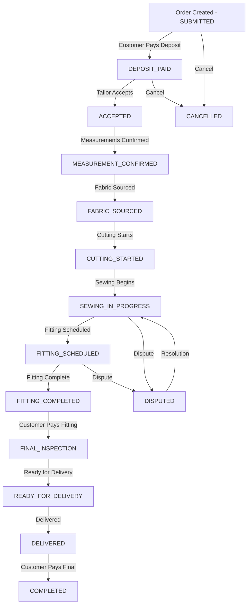

# Complete Order Workflow - Testing Guide

## Order Lifecycle Overview



## Complete Order Flow with All Touchpoints

### Stage 1: Order Creation (SUBMITTED)

**Status:** `SUBMITTED` (Progress: 0%)
**Escrow Stage:** `DEPOSIT`

#### What Happens:
1. Customer fills order form with garment details
2. System creates order record
3. Escrow amounts calculated (25-50-25%)
4. Initial milestone records created

#### API Endpoint:
```http
POST /api/orders/create
Content-Type: application/json

{
  "customerId": "uuid",
  "tailorId": "uuid",
  "garmentType": "dashiki",
  "fabricChoice": "TAILOR_SOURCED",
  "totalAmount": 300.00,
  "estimatedDelivery": "2025-11-20",
  "specialInstructions": "Custom embroidery"
}
```

#### Response:
```json
{
  "success": true,
  "orderId": "uuid",
  "orderNumber": "ORD-1761000144310-HW4065"
}
```

#### Notifications Sent:
1. **To Tailor:**
   - Channel: WhatsApp + In-App
   - Title: "New Order Received! 🎉"
   - Message: "You have a new order #ORD-XXX for dashiki. Total: GHS 300"
   - Priority: HIGH

2. **To Customer:**
   - Channel: WhatsApp + In-App
   - Title: "Order Created Successfully"
   - Message: "Your order #ORD-XXX has been created. Please pay the deposit of GHS 75 to confirm."
   - Priority: HIGH

#### Database Changes:
- Order record created in `orders` table
- 3 milestone records created in `order_milestones`:
  - DEPOSIT (25%, PENDING)
  - FITTING (50%, PENDING)
  - FINAL (25%, PENDING)

#### Testing Checklist:
- [ ] Order created with correct status `SUBMITTED`
- [ ] Order number generated correctly
- [ ] Escrow amounts calculated (75 + 150 + 75 = 300)
- [ ] Tailor receives WhatsApp notification
- [ ] Customer receives WhatsApp notification
- [ ] Both notifications logged in database
- [ ] Milestone records created

---

### Stage 2: Deposit Payment (SUBMITTED → DEPOSIT_PAID)

**Status:** `DEPOSIT_PAID` (Progress: 10%)
**Escrow Stage:** `DEPOSIT`
**Payment:** 25% (GHS 75)

#### What Happens:
1. Customer initiates mobile money payment
2. Payment gateway processes transaction
3. Webhook received with payment confirmation
4. Order status updated automatically
5. Notifications sent to both parties

#### API Endpoints:

**Initiate Payment:**
```http
POST /api/payments/escrow/initiate
Content-Type: application/json

{
  "orderId": "uuid",
  "amount": 75.00,
  "customerPhoneNumber": "+233241234567",
  "paymentMethod": "MTN_MOMO"
}
```

**Webhook (Hubtel):**
```http
POST /api/webhooks/hubtel
Content-Type: application/json
X-Hubtel-Signature: signature_here

{
  "transactionId": "TXN-123",
  "status": "Success",
  "amount": 75.00,
  "reference": "ORDER_uuid_DEPOSIT"
}
```

#### Automatic Processing:
1. Webhook verifies signature
2. Finds order by transaction reference
3. Calls `orderStatusService.handlePaymentConfirmation(orderId, 'deposit', transactionId)`
4. Status transitions: `SUBMITTED` → `DEPOSIT_PAID`
5. Updates `deposit_paid` and `deposit_paid_at` fields

#### Notifications Sent:
1. **To Tailor:**
   - Channel: WhatsApp + In-App
   - Title: "Payment Received - Start Production"
   - Message: "Deposit received for order #ORD-XXX. You can now start working on the dashiki."
   - Priority: HIGH

2. **To Customer:**
   - Channel: WhatsApp + In-App
   - Title: "Order Progress Update"
   - Message: "Your order #ORD-XXX is now DEPOSIT_PAID. 10% complete."
   - Priority: NORMAL

#### Database Changes:
- `orders.status` = `DEPOSIT_PAID`
- `orders.deposit_paid` = 75.00
- `orders.deposit_paid_at` = timestamp
- `order_milestones.status` = `PAID` (for DEPOSIT milestone)
- `payment_transactions` record created
- `order_status_history` entry logged

#### Testing Checklist:
- [ ] Payment initiated successfully
- [ ] Mobile money prompt received by customer
- [ ] Webhook received and verified
- [ ] Order status changed to `DEPOSIT_PAID`
- [ ] Deposit amount recorded correctly
- [ ] Payment timestamp recorded
- [ ] Both parties receive notifications
- [ ] Transaction logged in payment_transactions
- [ ] Status transition logged in history

---

### Stage 3: Tailor Accepts Order (DEPOSIT_PAID → ACCEPTED)

**Status:** `ACCEPTED` (Progress: 15%)
**Escrow Stage:** `DEPOSIT`

#### What Happens:
1. Tailor reviews order details
2. Tailor accepts order through dashboard
3. Status updated
4. Customer notified

#### API Endpoint:
```http
POST /api/orders/{orderId}/accept
Content-Type: application/json

{
  "estimatedCompletionDate": "2025-11-20",
  "notes": "Will start immediately"
}
```

#### Notifications Sent:
1. **To Customer:**
   - Channel: WhatsApp + In-App
   - Title: "Tailor Accepted Your Order"
   - Message: "Your tailor has accepted order #ORD-XXX. Work will begin shortly."
   - Priority: NORMAL

#### Testing Checklist:
- [ ] Tailor can accept order
- [ ] Status changes to `ACCEPTED`
- [ ] Customer notified
- [ ] Progress updates to 15%

---

### Stage 4-7: Production Stages (Manual Progression)

#### MEASUREMENT_CONFIRMED (20%)
- Tailor confirms measurements
- No payment required
- Customer notified

#### FABRIC_SOURCED (25%)
- Tailor uploads fabric photos
- Customer can see progress
- Milestone photo stored

#### CUTTING_STARTED (35%)
- Tailor uploads cutting photos
- Progress notification sent

#### SEWING_IN_PROGRESS (45%)
- Tailor uploads sewing progress
- Regular updates to customer

**API Endpoint for Milestone Upload:**
```http
POST /api/orders/{orderId}/milestone/upload
Content-Type: application/json

{
  "milestone": "FABRIC_SOURCED",
  "photoUrls": [
    "https://storage.supabase.co/..../fabric1.jpg",
    "https://storage.supabase.co/..../fabric2.jpg"
  ],
  "notes": "Selected premium cotton fabric as requested"
}
```

#### Response:
```json
{
  "success": true,
  "message": "Milestone uploaded successfully",
  "data": {
    "milestoneId": "uuid",
    "milestone": "FABRIC_SOURCED",
    "photoCount": 2,
    "statusUpdated": false
  }
}
```

#### Notifications (for each milestone):
- **To Customer:**
  - Channel: WhatsApp + In-App
  - Title: "New Progress Update! 📸"
  - Message: "Your tailor has uploaded 2 new photos for 'fabric sourced' stage."
  - Priority: NORMAL

#### Testing Checklist (for each stage):
- [ ] Tailor can upload photos
- [ ] Photos stored in Supabase Storage
- [ ] Milestone record created/updated
- [ ] Customer receives notification
- [ ] Photos visible in customer dashboard
- [ ] Progress percentage updated

---

### Stage 8: Fitting Ready (SEWING_IN_PROGRESS → FITTING_SCHEDULED)

**Status:** `FITTING_SCHEDULED` (Progress: 55%)
**Escrow Stage:** `FITTING`

#### What Happens:
1. Tailor completes initial sewing
2. Uploads fitting photos with `requestFitting: true`
3. Status automatically changes to `FITTING_SCHEDULED`
4. Customer receives high-priority notification to review

#### API Endpoint:
```http
POST /api/orders/{orderId}/milestone/upload
Content-Type: application/json

{
  "milestone": "FITTING_READY",
  "photoUrls": [
    "https://.../fitting_front.jpg",
    "https://.../fitting_back.jpg",
    "https://.../fitting_side.jpg"
  ],
  "notes": "Ready for fitting review",
  "requestFitting": true
}
```

#### Automatic Processing:
- Status transition triggered: `onFittingScheduled`
- Escrow stage changes to `FITTING`

#### Notifications Sent:
1. **To Customer:**
   - Channel: WhatsApp + In-App + Email
   - Title: "Fitting Photos Ready for Review! 👔"
   - Message: "Please review the fitting photos for order #ORD-XXX and approve to continue. Your approval will release the next payment."
   - Priority: HIGH

#### Testing Checklist:
- [ ] Fitting photos uploaded
- [ ] Status automatically changes to `FITTING_SCHEDULED`
- [ ] Escrow stage changes to `FITTING`
- [ ] Customer receives high-priority notification
- [ ] Photos appear in review section
- [ ] Approve/Reject buttons visible

---

### Stage 9: Fitting Approved (FITTING_SCHEDULED → FITTING_COMPLETED)

**Status:** `FITTING_COMPLETED` (Progress: 65%)
**Escrow Stage:** `FITTING`
**Payment Triggered:** 50% (GHS 150)

#### What Happens:
1. Customer reviews fitting photos
2. Customer approves fitting
3. Status updated to `FITTING_COMPLETED`
4. **Payment request automatically initiated**
5. Both parties notified

#### API Endpoint:
```http
POST /api/orders/{orderId}/milestone/approve
Content-Type: application/json

{
  "stage": "FITTING",
  "notes": "Looks perfect! Please continue."
}
```

#### Automatic Processing:
1. Escrow service approves milestone
2. Status transitions: `FITTING_SCHEDULED` → `FITTING_COMPLETED`
3. Payment request initiated for 50% (GHS 150)
4. Notifications sent

#### Notifications Sent:
1. **To Customer:**
   - Channel: WhatsApp + In-App
   - Title: "Fitting Payment Due"
   - Message: "Please complete the fitting payment of GHS 150 for order #ORD-XXX"
   - Data: Includes payment URL
   - Priority: HIGH

2. **To Tailor:**
   - Channel: WhatsApp + In-App
   - Title: "FITTING Milestone Approved"
   - Message: "Customer has approved the fitting milestone. You can continue with the order."
   - Priority: NORMAL

#### Testing Checklist:
- [ ] Customer can approve fitting
- [ ] Status changes to `FITTING_COMPLETED`
- [ ] Payment request initiated automatically
- [ ] Customer receives payment link
- [ ] Tailor notified of approval
- [ ] Amount (GHS 150) is correct

---

### Stage 10: Fitting Payment (FITTING_COMPLETED → FINAL_INSPECTION)

**Status:** `FINAL_INSPECTION` (Progress: 80%)
**Escrow Stage:** `FITTING`
**Payment:** 50% (GHS 150)

#### What Happens:
1. Customer pays fitting amount via mobile money
2. Webhook confirms payment
3. Status automatically transitions
4. Tailor can continue to final production

#### Webhook Processing:
```http
POST /api/webhooks/hubtel
Content-Type: application/json

{
  "transactionId": "TXN-456",
  "status": "Success",
  "amount": 150.00,
  "reference": "ORDER_uuid_FITTING"
}
```

#### Automatic Processing:
1. Find order by transaction ID
2. Verify payment stage is `FITTING`
3. Call `orderStatusService.handlePaymentConfirmation(orderId, 'fitting', transactionId)`
4. Status transitions: `FITTING_COMPLETED` → `FINAL_INSPECTION`

#### Notifications Sent:
- **To Both Parties:**
  - Progress update notifications
  - Payment confirmation

#### Database Changes:
- `orders.status` = `FINAL_INSPECTION`
- `orders.fitting_paid` = 150.00
- `orders.fitting_paid_at` = timestamp
- Payment transaction logged

#### Testing Checklist:
- [ ] Fitting payment processed
- [ ] Status changes to `FINAL_INSPECTION`
- [ ] Fitting amount recorded
- [ ] Both parties notified
- [ ] Progress updates to 80%

---

### Stage 11: Final Inspection & Ready (FINAL_INSPECTION → READY_FOR_DELIVERY)

**Status:** `READY_FOR_DELIVERY` (Progress: 90%)
**Escrow Stage:** `FINAL`

#### What Happens:
1. Tailor completes final work
2. Uploads final inspection photos
3. Marks as ready for delivery
4. Customer notified

#### API Endpoint:
```http
POST /api/orders/{orderId}/milestone/upload
Content-Type: application/json

{
  "milestone": "READY_FOR_DELIVERY",
  "photoUrls": [
    "https://.../final1.jpg",
    "https://.../final2.jpg"
  ],
  "notes": "Order complete and ready for pickup"
}
```

#### Automatic Processing:
- Status transition: `FINAL_INSPECTION` → `READY_FOR_DELIVERY`
- Escrow stage changes to `FINAL`

#### Notifications Sent:
1. **To Customer:**
   - Channel: WhatsApp + In-App
   - Title: "Your Garment is Ready! 🎉"
   - Message: "Your beautiful dashiki is complete and ready for pickup/delivery!"
   - Priority: HIGH

#### Testing Checklist:
- [ ] Final photos uploaded
- [ ] Status changes to `READY_FOR_DELIVERY`
- [ ] Escrow stage changes to `FINAL`
- [ ] Customer receives notification
- [ ] Delivery/pickup details visible

---

### Stage 12: Delivery (READY_FOR_DELIVERY → DELIVERED)

**Status:** `DELIVERED` (Progress: 95%)
**Escrow Stage:** `FINAL`

#### What Happens:
1. Customer receives garment
2. Customer confirms delivery in app
3. Status updated to `DELIVERED`
4. Final payment request initiated

#### API Endpoint:
```http
POST /api/orders/{orderId}/delivery/confirm
Content-Type: application/json

{
  "deliveryMethod": "PICKUP",
  "notes": "Received in perfect condition",
  "receivedDate": "2025-11-20"
}
```

#### Automatic Processing:
- Status transition: `READY_FOR_DELIVERY` → `DELIVERED`
- Final payment (25%) request sent

#### Notifications Sent:
1. **To Customer:**
   - Channel: WhatsApp + In-App
   - Title: "Final Payment Due"
   - Message: "Please complete the final payment of GHS 75 for order #ORD-XXX"
   - Priority: HIGH

2. **To Tailor:**
   - Channel: WhatsApp + In-App
   - Title: "Order Delivered"
   - Message: "Order #ORD-XXX has been delivered to customer."
   - Priority: NORMAL

#### Testing Checklist:
- [ ] Delivery can be confirmed
- [ ] Status changes to `DELIVERED`
- [ ] Final payment request sent
- [ ] Customer receives payment link
- [ ] Tailor notified of delivery

---

### Stage 13: Order Completion (DELIVERED → COMPLETED)

**Status:** `COMPLETED` (Progress: 100%)
**Escrow Stage:** `RELEASED`
**Payment:** 25% (GHS 75) - Final payment

#### What Happens:
1. Customer pays final amount
2. Webhook confirms payment
3. Status changes to `COMPLETED`
4. **All escrow funds released to tailor**
5. Both parties notified
6. Review request sent to customer

#### Webhook Processing:
```http
POST /api/webhooks/hubtel
Content-Type: application/json

{
  "transactionId": "TXN-789",
  "status": "Success",
  "amount": 75.00,
  "reference": "ORDER_uuid_FINAL"
}
```

#### Automatic Processing:
1. Payment confirmed
2. Status transition: `DELIVERED` → `COMPLETED`
3. Escrow stage changes to `RELEASED`
4. All funds released to tailor

#### Notifications Sent:
1. **To Customer:**
   - Channel: WhatsApp + In-App
   - Title: "Order Complete! 🎉"
   - Message: "Thank you! Your order #ORD-XXX is complete. Please leave a review."
   - Priority: HIGH

2. **To Tailor:**
   - Channel: WhatsApp + In-App
   - Title: "Order Completed! 🎉"
   - Message: "Order #ORD-XXX has been completed. Final payment of GHS 75 has been released."
   - Priority: HIGH

#### Database Changes:
- `orders.status` = `COMPLETED`
- `orders.final_paid` = 75.00
- `orders.final_paid_at` = timestamp
- `orders.escrow_stage` = `RELEASED`
- All milestone statuses = `COMPLETED`

#### Testing Checklist:
- [ ] Final payment processed
- [ ] Status changes to `COMPLETED`
- [ ] Escrow stage changes to `RELEASED`
- [ ] All payments recorded (75 + 150 + 75 = 300)
- [ ] Both parties receive completion notifications
- [ ] Review prompt shown to customer
- [ ] Order marked as complete in dashboards

---

## Exception Flows

### Cancellation (Any Status → CANCELLED)

#### Allowed From:
- `SUBMITTED` (before deposit)
- `DEPOSIT_PAID` (with refund)

#### API Endpoint:
```http
POST /api/orders/{orderId}/cancel
Content-Type: application/json

{
  "reason": "Customer changed mind",
  "cancelledBy": "CUSTOMER"
}
```

#### Processing:
- Calculate refund based on current stage
- Initiate refund if applicable
- Update status to `CANCELLED`
- Notify both parties

#### Testing Checklist:
- [ ] Order can be cancelled
- [ ] Refund calculated correctly
- [ ] Both parties notified
- [ ] Escrow stage changes to `REFUNDED`

---

### Dispute (Various Statuses → DISPUTED)

#### Can be initiated from:
- `SEWING_IN_PROGRESS`
- `FITTING_SCHEDULED`
- `FITTING_COMPLETED`
- `READY_FOR_DELIVERY`

#### API Endpoint:
```http
POST /api/orders/{orderId}/dispute
Content-Type: application/json

{
  "reason": "Quality concerns",
  "description": "The fabric used is different from what was shown",
  "evidence": ["photo1.jpg", "photo2.jpg"]
}
```

#### Processing:
- Status changes to `DISPUTED`
- Escrow funds held
- Admin team notified
- Both parties notified

#### Testing Checklist:
- [ ] Dispute can be initiated
- [ ] Funds held in escrow
- [ ] Admin notified
- [ ] Both parties can submit evidence
- [ ] Resolution triggers status change

---

## Complete API Endpoints Summary

### Order Management
```
POST   /api/orders/create                          - Create new order
GET    /api/orders/{id}                            - Get order details
POST   /api/orders/{id}/accept                     - Tailor accepts order
POST   /api/orders/{id}/cancel                     - Cancel order
POST   /api/orders/{id}/dispute                    - Initiate dispute
```

### Milestone Management
```
POST   /api/orders/{id}/milestone/upload           - Upload milestone photos
GET    /api/orders/{id}/milestone/upload           - Get all milestones
POST   /api/orders/{id}/milestone/approve          - Approve milestone
```

### Payment & Escrow
```
POST   /api/payments/escrow/initiate               - Initiate payment
GET    /api/orders/{id}/escrow/status              - Get escrow status
```

### Webhooks
```
POST   /api/webhooks/hubtel                        - Payment webhook
GET    /api/webhooks/hubtel                        - Webhook health check
POST   /api/webhooks/twilio/whatsapp               - WhatsApp webhook
```

### Delivery
```
POST   /api/orders/{id}/delivery/confirm           - Confirm delivery
POST   /api/orders/{id}/delivery/schedule          - Schedule delivery
```

---

## Notification Summary

### Notification Channels
1. **WhatsApp** - Primary channel (Twilio/Facebook API)
2. **In-App** - Stored in database notifications table
3. **SMS** - Fallback if WhatsApp fails
4. **Email** - For critical updates (fitting approval, completion)

### Priority Levels
- **HIGH** - Immediate action required (payments, approvals)
- **NORMAL** - Informational updates (progress, status changes)
- **LOW** - Optional updates (reminders)

### Notification Triggers
| Event | Customer Notified | Tailor Notified | Priority |
|-------|------------------|-----------------|----------|
| Order Created | ✅ | ✅ | HIGH |
| Deposit Paid | ✅ | ✅ | HIGH |
| Order Accepted | ✅ | ❌ | NORMAL |
| Milestone Uploaded | ✅ | ❌ | NORMAL |
| Fitting Ready | ✅ | ❌ | HIGH |
| Fitting Approved | ✅ | ✅ | HIGH |
| Fitting Payment | ✅ | ✅ | NORMAL |
| Ready for Delivery | ✅ | ❌ | HIGH |
| Delivered | ✅ | ✅ | NORMAL |
| Final Payment | ✅ | ✅ | HIGH |
| Completed | ✅ | ✅ | HIGH |
| Cancelled | ✅ | ✅ | HIGH |
| Disputed | ✅ | ✅ | HIGH |

---

## Testing Scenarios

### Happy Path Test
1. Create order → Verify `SUBMITTED` status
2. Pay deposit → Verify `DEPOSIT_PAID` status + notifications
3. Tailor accepts → Verify `ACCEPTED` status
4. Progress through production stages
5. Upload fitting photos → Verify `FITTING_SCHEDULED`
6. Approve fitting → Verify payment request + `FITTING_COMPLETED`
7. Pay fitting amount → Verify `FINAL_INSPECTION`
8. Upload final photos → Verify `READY_FOR_DELIVERY`
9. Confirm delivery → Verify `DELIVERED`
10. Pay final amount → Verify `COMPLETED` + escrow released

### Edge Cases
- [ ] Order created but never paid (stays in `SUBMITTED`)
- [ ] Payment fails multiple times
- [ ] Customer rejects fitting (needs adjustments)
- [ ] Order cancelled at various stages
- [ ] Dispute raised and resolved
- [ ] Network failure during webhook
- [ ] Duplicate webhook received
- [ ] Invalid payment amount
- [ ] Tailor uploads wrong milestone for current status

### Performance Tests
- [ ] 100 concurrent order creations
- [ ] Webhook processing under load
- [ ] Notification delivery success rate
- [ ] Database query performance
- [ ] Image upload performance

---

## Monitoring & Debugging

### Key Metrics to Track
1. **Order Funnel:**
   - Orders created
   - Orders with deposit paid (conversion rate)
   - Orders completed
   - Average time per stage

2. **Payment Success Rate:**
   - Deposit payment success rate
   - Fitting payment success rate
   - Final payment success rate
   - Average time to payment

3. **Notification Delivery:**
   - WhatsApp delivery rate
   - SMS fallback rate
   - In-app notification open rate

4. **Status Transition Times:**
   - Average time in each status
   - Bottlenecks identification

### Debug Endpoints
```
GET /api/debug/order/{id}/status-history    - View status transitions
GET /api/debug/order/{id}/notifications     - View all notifications sent
GET /api/debug/order/{id}/payments          - View payment history
GET /api/debug/webhooks/recent              - View recent webhook calls
```

### Logging
All key events should log:
- Order ID
- User ID (customer/tailor)
- Action performed
- Previous status → New status
- Timestamp
- Result (success/failure)
- Error details (if applicable)

---

## Production Deployment Checklist

### Pre-Deployment
- [ ] All environment variables configured
- [ ] Twilio WhatsApp verified
- [ ] Hubtel API credentials tested
- [ ] Webhook URLs updated with production domain
- [ ] Database migrations run
- [ ] SSL certificates installed

### Post-Deployment
- [ ] Create test order end-to-end
- [ ] Verify webhooks are received
- [ ] Check notification delivery
- [ ] Monitor error logs for 24 hours
- [ ] Verify payment flow works
- [ ] Test on real mobile devices

### Rollback Plan
- [ ] Database backup taken
- [ ] Previous version available
- [ ] Rollback procedure documented
- [ ] Customer communication plan ready

---

This document provides complete testing coverage for the entire order workflow with all touchpoints documented.
