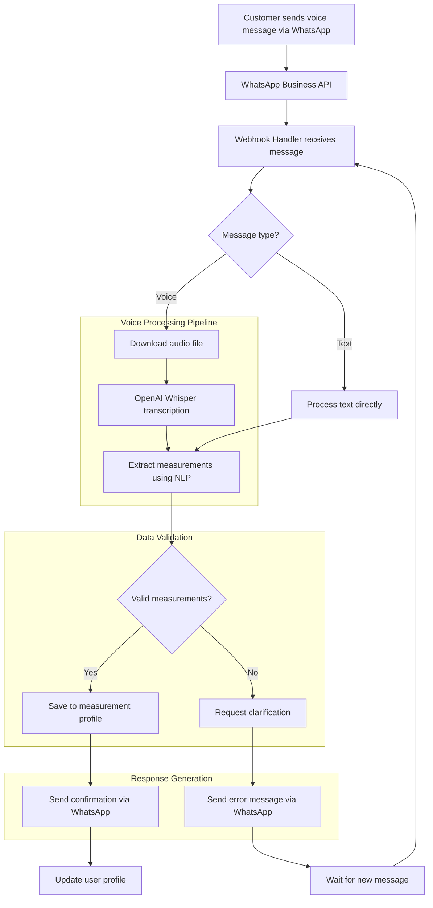

# Sew4Mi Architecture Diagrams

## Table of Contents
1. [System Context Diagram](#system-context-diagram)
2. [Detailed Component Architecture](#detailed-component-architecture)
3. [Data Flow Diagrams](#data-flow-diagrams)
4. [Deployment Architecture](#deployment-architecture)
5. [Security Architecture](#security-architecture)
6. [WhatsApp Integration Architecture](#whatsapp-integration-architecture)
7. [Mobile Money Payment Flow](#mobile-money-payment-flow)
8. [Real-time Communication Architecture](#real-time-communication-architecture)

## System Context Diagram


## Detailed Component Architecture


## Data Flow Diagrams

### Order Creation Data Flow


### WhatsApp Voice Processing Data Flow



## Deployment Architecture

### Production Deployment Diagram

```mermaid
graph TB
    subgraph "User Access Layer"
        U1[Ghana Customers<br/>Mobile 3G/4G]
        U2[Expert Tailors<br/>Mobile/Desktop]
        U3[Admin Users<br/>Desktop]
    end
    
    subgraph "CDN & Edge - Vercel Global Network"
        CDN[Vercel Edge CDN<br/>100+ Locations]
        EDGE[Edge Functions<br/>Europe Region (Closest to Ghana)]
    end
    
    subgraph "Application Layer - Vercel"
        WEB[Next.js Application<br/>Static + Server Components]
        API[API Routes<br/>Serverless Functions]
        ADMIN[Admin Dashboard<br/>Separate Deployment]
    end
    
    subgraph "Database Layer - Supabase EU"
        DB[(PostgreSQL<br/>with PostGIS)]
        AUTH[Supabase Auth<br/>JWT + RLS]
        STORAGE[Supabase Storage<br/>CDN Distribution]
        RT[Realtime Engine<br/>WebSocket Connections]
    end
    
    subgraph "External Services"
        WA[WhatsApp Business API<br/>Meta Infrastructure]
        MTN[MTN Mobile Money API<br/>Ghana]
        VOD[Vodafone Cash API<br/>Ghana]
        AI[OpenAI Whisper API<br/>Global]
        MAPS[Google Maps API<br/>Global]
    end
    
    subgraph "Monitoring & Logging"
        SENTRY[Sentry<br/>Error Tracking]
        AXIOM[Axiom<br/>Structured Logging]
        VERCEL_A[Vercel Analytics<br/>Performance Monitoring]
    end
    
    U1 --> CDN
    U2 --> CDN
    U3 --> CDN
    
    CDN --> EDGE
    EDGE --> WEB
    EDGE --> API
    WEB --> ADMIN
    
    API --> DB
    API --> AUTH
    API --> STORAGE
    WEB --> RT
    
    API --> WA
    API --> MTN
    API --> VOD
    API --> AI
    API --> MAPS
    
    WEB --> SENTRY
    API --> SENTRY
    API --> AXIOM
    WEB --> VERCEL_A
    
    classDef userLayer fill:#e1f5fe
    classDef edgeLayer fill:#f3e5f5
    classDef appLayer fill:#e8f5e8
    classDef dataLayer fill:#fff3e0
    classDef externalLayer fill:#ffebee
    classDef monitoringLayer fill:#f5f5f5
    
    class U1,U2,U3 userLayer
    class CDN,EDGE edgeLayer
    class WEB,API,ADMIN appLayer
    class DB,AUTH,STORAGE,RT dataLayer
    class WA,MTN,VOD,AI,MAPS externalLayer
    class SENTRY,AXIOM,VERCEL_A monitoringLayer
```

### CI/CD Pipeline Architecture

```mermaid
flowchart LR
    DEV[Developer Commits] --> GIT[GitHub Repository]
    GIT --> PR[Pull Request Created]
    
    PR --> CHECKS{GitHub Actions<br/>Quality Gates}
    
    CHECKS --> LINT[ESLint + Prettier]
    CHECKS --> TYPE[TypeScript Check]
    CHECKS --> TEST[Test Suite]
    CHECKS --> BUILD[Build Verification]
    
    LINT --> PREVIEW_CHECK{All Checks Pass?}
    TYPE --> PREVIEW_CHECK
    TEST --> PREVIEW_CHECK
    BUILD --> PREVIEW_CHECK
    
    PREVIEW_CHECK -->|No| FAIL[❌ PR Blocked]
    PREVIEW_CHECK -->|Yes| PREVIEW[Vercel Preview Deploy]
    
    PREVIEW --> REVIEW[Code Review + Manual Testing]
    REVIEW --> MERGE[Merge to Main]
    
    MERGE --> PROD_CHECKS{Production Checks}
    PROD_CHECKS --> E2E[E2E Tests]
    PROD_CHECKS --> SECURITY[Security Scan]
    PROD_CHECKS --> PERF[Performance Test]
    
    E2E --> PROD_DEPLOY{Ready for Production?}
    SECURITY --> PROD_DEPLOY
    PERF --> PROD_DEPLOY
    
    PROD_DEPLOY -->|No| ROLLBACK[❌ Auto Rollback]
    PROD_DEPLOY -->|Yes| PRODUCTION[🚀 Production Deploy]
    
    PRODUCTION --> VERIFY[Health Checks]
    VERIFY --> NOTIFY[Slack Notification]
    
    subgraph "Quality Gates"
        LINT
        TYPE
        TEST
        BUILD
    end
    
    subgraph "Production Gates"
        E2E
        SECURITY
        PERF
    end
    
    subgraph "Environments"
        PREVIEW
        PRODUCTION
    end
```



## Security Architecture

### Authentication & Authorization Flow


### Data Security & Privacy


## WhatsApp Integration Architecture

### WhatsApp Business API Integration

```mermaid
graph TB
    subgraph "User Layer"
        C[Customer with WhatsApp]
        F[Family Group Chat]
    end
    
    subgraph "WhatsApp Platform"
        WBA[WhatsApp Business API]
        META[Meta Servers]
    end
    
    subgraph "Sew4Mi Integration"
        WH[Webhook Handler<br/>Vercel Edge Function]
        VP[Voice Processor<br/>Audio → Text → Data]
        ML[Message Logic<br/>Intent Recognition]
        DB[(Message History<br/>PostgreSQL)]
    end
    
    subgraph "AI Services"
        WHISPER[OpenAI Whisper<br/>Speech-to-Text]
        NLP[Custom NLP<br/>Measurement Extraction]
    end
    
    subgraph "Business Services"
        ORDER[Order Service<br/>State Management]
        MEASURE[Measurement Service<br/>Profile Management]
        NOTIFY[Notification Templates<br/>Multi-language]
    end
    
    C -->|Voice/Text Messages| WBA
    F -->|Group Coordination| WBA
    WBA -->|Webhook| WH
    
    WH -->|Audio File| VP
    VP -->|Audio| WHISPER
    WHISPER -->|Transcript| NLP
    NLP -->|Structured Data| MEASURE
    
    WH -->|Text Message| ML
    ML -->|Intent| ORDER
    ML -->|Intent| MEASURE
    
    WH -->|Store| DB
    ORDER -->|Update Status| NOTIFY
    MEASURE -->|Confirm Saved| NOTIFY
    
    NOTIFY -->|Response Message| WBA
    WBA -->|Delivery| C
    WBA -->|Group Update| F
    
    subgraph "Message Types"
        VOICE[Voice Measurements<br/>"My chest is 40 inches"]
        TEXT[Text Orders<br/>"I want a shirt"]
        PHOTO[Photo Sharing<br/>Fabric selections]
        STATUS[Status Updates<br/>Order progress]
    end
    
    VP -.->|Handles| VOICE
    ML -.->|Handles| TEXT
    WH -.->|Handles| PHOTO
    NOTIFY -.->|Sends| STATUS
```

### WhatsApp Message Flow States


## Mobile Money Payment Flow

### Payment Processing Architecture


### Payment Provider Failover

```mermaid
flowchart TD
    START[Payment Initiated] --> SELECT{Provider Selection}
    
    SELECT -->|Primary| MTN[Try MTN MoMo]
    SELECT -->|Fallback| VOD[Try Vodafone Cash]
    SELECT -->|User Choice| BOTH[Both Available]
    
    MTN --> MTN_RESULT{MTN Response}
    VOD --> VOD_RESULT{Vodafone Response}
    BOTH --> USER_SELECT[User Selects Provider]
    
    USER_SELECT --> MTN
    USER_SELECT --> VOD
    
    MTN_RESULT -->|Success| MTN_PROCESS[Process MTN Payment]
    MTN_RESULT -->|Failure| MTN_RETRY[Retry MTN]
    MTN_RESULT -->|Error| FALLBACK_VOD[Try Vodafone]
    
    VOD_RESULT -->|Success| VOD_PROCESS[Process Vodafone Payment]
    VOD_RESULT -->|Failure| VOD_RETRY[Retry Vodafone]
    VOD_RESULT -->|Error| FALLBACK_MTN[Try MTN]
    
    MTN_RETRY --> MTN_RETRY_RESULT{Retry Result}
    VOD_RETRY --> VOD_RETRY_RESULT{Retry Result}
    
    MTN_RETRY_RESULT -->|Success| MTN_PROCESS
    MTN_RETRY_RESULT -->|Failure| FALLBACK_VOD
    
    VOD_RETRY_RESULT -->|Success| VOD_PROCESS
    VOD_RETRY_RESULT -->|Failure| FALLBACK_MTN
    
    FALLBACK_VOD --> VOD
    FALLBACK_MTN --> MTN
    
    MTN_PROCESS --> SUCCESS[✅ Payment Successful]
    VOD_PROCESS --> SUCCESS
    
    SUCCESS --> UPDATE_ORDER[Update Order Status]
    UPDATE_ORDER --> NOTIFY[Notify All Parties]
    NOTIFY --> END[Complete]
    
    subgraph "Error Handling"
        ERROR[❌ All Providers Failed]
        ERROR --> MANUAL[Flag for Manual Review]
        MANUAL --> SUPPORT[Customer Support Contact]
    end
    
    MTN_RETRY_RESULT -->|Final Failure| ERROR
    VOD_RETRY_RESULT -->|Final Failure| ERROR
    
    classDef successClass fill:#c8e6c9
    classDef errorClass fill:#ffcdd2
    classDef processClass fill:#bbdefb
    classDef retryClass fill:#fff9c4
    
    class SUCCESS,UPDATE_ORDER,NOTIFY,END successClass
    class ERROR,MANUAL,SUPPORT errorClass
    class MTN_PROCESS,VOD_PROCESS processClass
    class MTN_RETRY,VOD_RETRY,FALLBACK_VOD,FALLBACK_MTN retryClass
```



## Real-time Communication Architecture

### Supabase Realtime Integration


### WebSocket Connection Management


---

## Usage Guidelines

### For Developers
- Use these diagrams as reference during implementation
- Update diagrams when architecture changes
- Include diagram references in code comments for complex flows

### For Product Teams
- Reference user flows for feature planning
- Use system context for stakeholder presentations
- Security diagrams help with compliance discussions

### For DevOps Teams
- Deployment diagrams guide infrastructure setup
- CI/CD pipeline diagrams document automation
- Monitoring diagrams show observability strategy

---

*This document provides visual representations of the Sew4Mi architecture to complement the main architecture document. Keep both documents synchronized as the system evolves.*