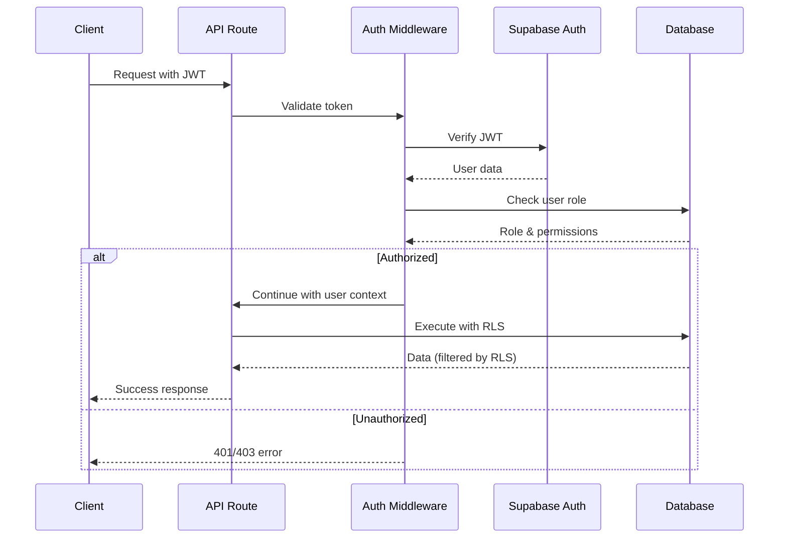

# Backend Architecture

## Service Architecture

### Serverless Architecture - Vercel Edge Functions

#### Function Organization
```
api/
├── orders/
│   ├── create.ts           # POST /api/orders/create
│   ├── [id]/
│   │   ├── index.ts        # GET /api/orders/[id]
│   │   ├── milestones.ts   # POST /api/orders/[id]/milestones
│   │   └── dispute.ts      # POST /api/orders/[id]/dispute
│   └── list.ts             # GET /api/orders/list
├── payments/
│   ├── initiate.ts         # POST /api/payments/initiate
│   ├── status.ts           # GET /api/payments/status
│   └── refund.ts           # POST /api/payments/refund
├── webhooks/
│   ├── whatsapp.ts         # WhatsApp webhook handler
│   ├── mtn.ts              # MTN Mobile Money webhook
│   └── vodafone.ts         # Vodafone Cash webhook
├── graphql/
│   └── index.ts            # GraphQL endpoint
└── _middleware.ts          # Global middleware
```

#### Function Template
```typescript
// api/orders/create.ts
import { NextRequest } from 'next/server';
import { z } from 'zod';
import { createServerClient } from '@/lib/supabase/server';
import { OrderService } from '@/services/order.service';
import { withAuth } from '@/middleware/auth';
import { withRateLimit } from '@/middleware/rateLimit';
import { withErrorHandler } from '@/middleware/error';

// Input validation schema
const createOrderSchema = z.object({
  tailorId: z.string().uuid(),
  measurementProfileId: z.string().uuid(),
  garmentType: z.string().min(1).max(100),
  fabricChoice: z.string().optional(),
  specialInstructions: z.string().max(1000).optional(),
  estimatedDelivery: z.string().datetime(),
  totalAmount: z.number().positive(),
});

// Edge function configuration
export const config = {
  runtime: 'edge',
  regions: ['iad1'], // US East - closest to Europe/Africa
};

// Main handler with middleware chain
export default withErrorHandler(
  withRateLimit(
    withAuth(['CUSTOMER'])(
      async (req: NextRequest, { user }) => {
        // Parse and validate input
        const body = await req.json();
        const validatedData = createOrderSchema.parse(body);
        
        // Initialize services
        const supabase = createServerClient();
        const orderService = new OrderService(supabase);
        
        // Business logic
        const order = await orderService.createOrder({
          customerId: user.id,
          ...validatedData,
        });
        
        // Return response
        return Response.json(order, { status: 201 });
      }
    )
  )
);
```

## Database Architecture

### Data Access Layer
```typescript
// lib/repositories/order.repository.ts
import { SupabaseClient } from '@supabase/supabase-js';
import { Database } from '@/types/database';
import { Order, CreateOrderInput } from '@/types/models';

export class OrderRepository {
  constructor(
    private supabase: SupabaseClient<Database>
  ) {}
  
  async create(data: CreateOrderInput): Promise<Order> {
    const orderNumber = await this.generateOrderNumber();
    
    const { data: order, error } = await this.supabase
      .from('orders')
      .insert({
        ...data,
        order_number: orderNumber,
        status: 'PENDING_DEPOSIT',
        escrow_stage: 'DEPOSIT',
      })
      .select(`
        *,
        customer:users!customer_id(*),
        tailor:tailor_profiles!tailor_id(*)
      `)
      .single();
      
    if (error) throw error;
    return this.mapToModel(order);
  }
  
  async findById(id: string): Promise<Order | null> {
    const { data, error } = await this.supabase
      .from('orders')
      .select(`
        *,
        customer:users!customer_id(*),
        tailor:tailor_profiles!tailor_id(*),
        milestones:order_milestones(*),
        payments:payment_transactions(*)
      `)
      .eq('id', id)
      .single();
      
    if (error) {
      if (error.code === 'PGRST116') return null;
      throw error;
    }
    
    return this.mapToModel(data);
  }
  
  async updateStatus(
    id: string, 
    status: Order['status']
  ): Promise<void> {
    const { error } = await this.supabase
      .from('orders')
      .update({ status, updated_at: new Date().toISOString() })
      .eq('id', id);
      
    if (error) throw error;
  }
  
  private async generateOrderNumber(): Promise<string> {
    const date = new Date();
    const prefix = `SW${date.getFullYear()}${String(date.getMonth() + 1).padStart(2, '0')}`;
    
    // Get today's order count
    const { count } = await this.supabase
      .from('orders')
      .select('*', { count: 'exact', head: true })
      .gte('created_at', new Date().toISOString().split('T')[0])
      .lte('created_at', new Date(Date.now() + 86400000).toISOString().split('T')[0]);
      
    const sequence = String((count || 0) + 1).padStart(4, '0');
    return `${prefix}${sequence}`;
  }
  
  private mapToModel(data: any): Order {
    // Map database fields to model
    return {
      id: data.id,
      orderNumber: data.order_number,
      customerId: data.customer_id,
      // ... map other fields
    };
  }
}
```

## Authentication and Authorization

### Auth Flow


### Middleware/Guards
```typescript
// middleware/auth.ts
import { NextRequest } from 'next/server';
import { createServerClient } from '@/lib/supabase/server';

type UserRole = 'CUSTOMER' | 'TAILOR' | 'ADMIN';

interface AuthContext {
  user: {
    id: string;
    email: string;
    role: UserRole;
  };
}

export function withAuth(allowedRoles: UserRole[] = []) {
  return (
    handler: (req: NextRequest, context: AuthContext) => Promise<Response>
  ) => {
    return async (req: NextRequest) => {
      try {
        // Get token from header
        const token = req.headers.get('authorization')?.replace('Bearer ', '');
        
        if (!token) {
          return Response.json(
            { error: 'No authorization token provided' },
            { status: 401 }
          );
        }
        
        // Verify with Supabase
        const supabase = createServerClient();
        const { data: { user }, error } = await supabase.auth.getUser(token);
        
        if (error || !user) {
          return Response.json(
            { error: 'Invalid token' },
            { status: 401 }
          );
        }
        
        // Get user role from database
        const { data: profile } = await supabase
          .from('users')
          .select('role')
          .eq('id', user.id)
          .single();
          
        if (!profile) {
          return Response.json(
            { error: 'User profile not found' },
            { status: 404 }
          );
        }
        
        // Check role permissions
        if (allowedRoles.length > 0 && !allowedRoles.includes(profile.role)) {
          return Response.json(
            { error: 'Insufficient permissions' },
            { status: 403 }
          );
        }
        
        // Call handler with user context
        return handler(req, {
          user: {
            id: user.id,
            email: user.email!,
            role: profile.role,
          },
        });
      } catch (error) {
        console.error('Auth middleware error:', error);
        return Response.json(
          { error: 'Authentication failed' },
          { status: 500 }
        );
      }
    };
  };
}

// middleware/rateLimit.ts
import { Ratelimit } from '@upstash/ratelimit';
import { kv } from '@vercel/kv';

const ratelimit = new Ratelimit({
  redis: kv,
  limiter: Ratelimit.slidingWindow(100, '1 m'), // 100 requests per minute
});

export function withRateLimit(
  handler: (req: NextRequest, ...args: any[]) => Promise<Response>
) {
  return async (req: NextRequest, ...args: any[]) => {
    const ip = req.headers.get('x-forwarded-for') ?? 'anonymous';
    const { success, limit, reset, remaining } = await ratelimit.limit(ip);
    
    if (!success) {
      return Response.json(
        { error: 'Too many requests' },
        {
          status: 429,
          headers: {
            'X-RateLimit-Limit': limit.toString(),
            'X-RateLimit-Remaining': remaining.toString(),
            'X-RateLimit-Reset': new Date(reset).toISOString(),
          },
        }
      );
    }
    
    return handler(req, ...args);
  };
}
```

## Business Logic Services

```typescript
// services/order.service.ts
import { SupabaseClient } from '@supabase/supabase-js';
import { OrderRepository } from '@/lib/repositories/order.repository';
import { PaymentService } from './payment.service';
import { NotificationService } from './notification.service';
import { OrderStateMachine } from '@/lib/state-machines/order';

export class OrderService {
  private orderRepo: OrderRepository;
  private paymentService: PaymentService;
  private notificationService: NotificationService;
  
  constructor(private supabase: SupabaseClient) {
    this.orderRepo = new OrderRepository(supabase);
    this.paymentService = new PaymentService();
    this.notificationService = new NotificationService();
  }
  
  async createOrder(input: CreateOrderInput): Promise<Order> {
    // Validate tailor availability
    const availability = await this.checkTailorAvailability(
      input.tailorId,
      input.estimatedDelivery
    );
    
    if (!availability) {
      throw new Error('Tailor not available for selected date');
    }
    
    // Calculate escrow amounts
    const escrowAmounts = this.calculateEscrow(input.totalAmount);
    
    // Create order in database
    const order = await this.orderRepo.create({
      ...input,
      depositPaid: 0,
      fittingPaid: 0,
      finalPaid: 0,
    });
    
    // Initialize payment
    const paymentRequest = await this.paymentService.initiatePayment({
      orderId: order.id,
      amount: escrowAmounts.deposit,
      type: 'DEPOSIT',
      customerId: input.customerId,
    });
    
    // Send notifications
    await this.notificationService.sendOrderCreated(order);
    
    return {
      ...order,
      paymentUrl: paymentRequest.url,
    };
  }
  
  async processPaymentWebhook(
    provider: 'MTN' | 'VODAFONE',
    payload: any
  ): Promise<void> {
    // Verify webhook signature
    const isValid = await this.paymentService.verifyWebhook(provider, payload);
    if (!isValid) {
      throw new Error('Invalid webhook signature');
    }
    
    // Update payment status
    const transaction = await this.paymentService.updateTransaction(
      payload.transactionId,
      payload.status
    );
    
    // Update order state machine
    const order = await this.orderRepo.findById(transaction.orderId);
    const stateMachine = new OrderStateMachine(order);
    
    if (payload.status === 'SUCCESS') {
      stateMachine.transition('PAYMENT_RECEIVED');
      await this.orderRepo.updateStatus(
        order.id,
        stateMachine.currentState
      );
      
      // Notify parties
      await this.notificationService.sendPaymentConfirmed(order, transaction);
    }
  }
  
  private calculateEscrow(totalAmount: number) {
    return {
      deposit: totalAmount * 0.25,
      fitting: totalAmount * 0.50,
      final: totalAmount * 0.25,
    };
  }
  
  private async checkTailorAvailability(
    tailorId: string,
    date: Date
  ): Promise<boolean> {
    // Check tailor's current workload
    const { count } = await this.supabase
      .from('orders')
      .select('*', { count: 'exact', head: true })
      .eq('tailor_id', tailorId)
      .in('status', ['IN_PROGRESS', 'READY_FOR_FITTING'])
      .gte('estimated_delivery', new Date().toISOString())
      .lte('estimated_delivery', date.toISOString());
      
    const { data: tailor } = await this.supabase
      .from('tailor_profiles')
      .select('capacity')
      .eq('id', tailorId)
      .single();
      
    return (count || 0) < (tailor?.capacity || 0);
  }
}
```
