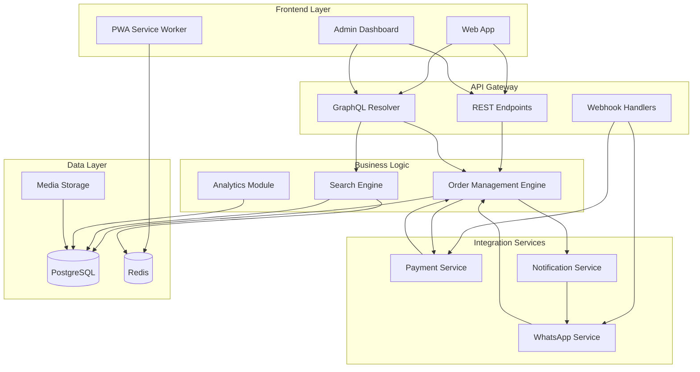

# Components

## Web Application (Customer & Tailor Portal)
**Responsibility:** Progressive web app serving both customers and tailors with role-based interfaces, optimized for mobile-first Ghana market

**Key Interfaces:**
- Next.js pages and API routes
- Supabase client for auth and real-time
- GraphQL client for complex queries
- Service worker for offline capability

**Dependencies:** Supabase services, WhatsApp Business API, Payment providers

**Technology Stack:** Next.js 14, React 18, TypeScript, Tailwind CSS, Shadcn/ui, Zustand, React Query

## Admin Dashboard
**Responsibility:** Internal administration tool for order monitoring, dispute resolution, tailor verification, and system health monitoring

**Key Interfaces:**
- Protected admin routes with role-based access
- Direct database queries for analytics
- Bulk operation endpoints
- System monitoring dashboards

**Dependencies:** Supabase admin SDK, Monitoring services

**Technology Stack:** Next.js 14, React 18, TypeScript, Recharts for analytics, React Table for data management

## WhatsApp Integration Service
**Responsibility:** Handle bidirectional WhatsApp communication including message processing, voice note transcription, and automated responses

**Key Interfaces:**
- Webhook endpoint for incoming messages
- Message sending API
- Voice processing pipeline
- Natural language understanding

**Dependencies:** WhatsApp Business API, OpenAI Whisper API, Translation services

**Technology Stack:** Vercel Edge Functions, TypeScript, WhatsApp Cloud API, OpenAI SDK

## Payment Processing Service
**Responsibility:** Manage mobile money integrations, escrow transactions, and payment reconciliation with providers

**Key Interfaces:**
- Payment initiation endpoints
- Webhook handlers for callbacks
- Transaction status queries
- Refund processing

**Dependencies:** MTN Mobile Money API, Vodafone Cash API, Database for transaction logs

**Technology Stack:** Vercel Edge Functions, TypeScript, Provider SDKs, Zod for validation

## Order Management Engine
**Responsibility:** Core business logic for order lifecycle, escrow state management, and milestone tracking

**Key Interfaces:**
- Order state machine
- Escrow calculation logic
- Milestone verification
- Delivery date estimation

**Dependencies:** Database, Payment service, Notification service

**Technology Stack:** TypeScript, XState for state machines, Temporal for long-running workflows

## Notification Service
**Responsibility:** Multi-channel notification delivery via email, SMS, WhatsApp, and in-app push notifications

**Key Interfaces:**
- Template management
- Channel selection logic
- Delivery status tracking
- User preference management

**Dependencies:** WhatsApp service, Email provider, SMS gateway

**Technology Stack:** Vercel Edge Functions, Resend for email, WhatsApp Cloud API

## Media Storage Service
**Responsibility:** Handle image uploads, optimization, and CDN delivery for portfolio items and milestone photos

**Key Interfaces:**
- Image upload API
- Automatic resizing/optimization
- Signed URL generation
- CDN invalidation

**Dependencies:** Supabase Storage, Vercel Image Optimization

**Technology Stack:** Supabase Storage SDK, Sharp for image processing, Vercel Image API

## Search & Discovery Engine
**Responsibility:** Enable tailor discovery with location-based search, filtering, and personalized recommendations

**Key Interfaces:**
- GraphQL search resolver
- Faceted search API
- Location-based queries
- Recommendation algorithm

**Dependencies:** PostgreSQL with PostGIS, Redis for caching

**Technology Stack:** PostgreSQL full-text search, PostGIS for geospatial, Redis for result caching

## Analytics & Reporting Module
**Responsibility:** Generate business insights, tailor performance metrics, and customer behavior analytics

**Key Interfaces:**
- Dashboard data APIs
- Report generation
- Export capabilities
- Real-time metrics

**Dependencies:** Database read replicas, Time-series data store

**Technology Stack:** PostgreSQL aggregations, Vercel Analytics, Custom dashboards with Recharts

## Resilience & Circuit Breaker Service
**Responsibility:** Prevent cascading failures and provide graceful degradation when external services are unavailable

**Key Interfaces:**
- Circuit breaker state management
- Health check endpoints
- Service status monitoring
- Fallback response generation

**Dependencies:** All external services (WhatsApp, Mobile Money, OpenAI)

**Technology Stack:** Custom circuit breaker implementation with Redis state storage

```typescript
// Circuit breaker implementation
export class CircuitBreaker {
  private failures = 0;
  private lastFailureTime = 0;
  private state: 'CLOSED' | 'OPEN' | 'HALF_OPEN' = 'CLOSED';
  
  constructor(
    private readonly failureThreshold = 5,
    private readonly recoveryTimeout = 60000 // 1 minute
  ) {}
  
  async execute<T>(operation: () => Promise<T>): Promise<T> {
    if (this.state === 'OPEN') {
      if (Date.now() - this.lastFailureTime > this.recoveryTimeout) {
        this.state = 'HALF_OPEN';
      } else {
        throw new Error('Service temporarily unavailable');
      }
    }
    
    try {
      const result = await operation();
      this.onSuccess();
      return result;
    } catch (error) {
      this.onFailure();
      throw error;
    }
  }
  
  private onSuccess() {
    this.failures = 0;
    this.state = 'CLOSED';
  }
  
  private onFailure() {
    this.failures++;
    this.lastFailureTime = Date.now();
    
    if (this.failures >= this.failureThreshold) {
      this.state = 'OPEN';
    }
  }
}
```

## Payment Reconciliation Service
**Responsibility:** Daily reconciliation of payments with mobile money providers, detecting discrepancies and ensuring financial accuracy

**Key Interfaces:**
- Automated daily reconciliation
- Discrepancy detection and alerting
- Manual reconciliation tools
- Financial reporting integration

**Dependencies:** Payment providers, Database, Admin notification system

**Technology Stack:** Scheduled functions, TypeScript, Provider APIs, PostgreSQL

## Fraud Detection Module
**Responsibility:** Monitor transactions and user behavior for suspicious activities and potential fraud

**Key Interfaces:**
- Real-time transaction monitoring
- Behavioral anomaly detection
- Risk scoring algorithms
- Alert generation and escalation

**Dependencies:** Payment transactions, User behavior data, Admin system

**Technology Stack:** TypeScript, PostgreSQL analytics, Machine learning models (future)

```typescript
// Fraud detection rules
export class FraudDetectionService {
  async analyzeTransaction(transaction: PaymentTransaction, user: User): Promise<RiskScore> {
    const riskFactors = [
      this.checkTransactionAmount(transaction),
      this.checkUserHistory(user),
      this.checkTransactionFrequency(user, transaction),
      this.checkDeviceFingerprint(transaction),
    ];
    
    const totalRisk = riskFactors.reduce((sum, factor) => sum + factor.score, 0);
    
    return {
      score: Math.min(totalRisk, 100),
      level: this.getRiskLevel(totalRisk),
      reasons: riskFactors.filter(f => f.score > 0).map(f => f.reason),
    };
  }
  
  private getRiskLevel(score: number): 'LOW' | 'MEDIUM' | 'HIGH' {
    if (score >= 70) return 'HIGH';
    if (score >= 40) return 'MEDIUM';
    return 'LOW';
  }
}
```

## Business Intelligence Dashboard
**Responsibility:** Real-time business metrics, KPI tracking, and executive reporting for business decisions

**Key Interfaces:**
- Executive dashboard with key metrics
- Tailor performance analytics
- Customer behavior insights
- Revenue and growth tracking

**Dependencies:** Database read replicas, Analytics service

**Technology Stack:** Next.js admin panel, Recharts, PostgreSQL aggregations

## Customer Support Portal
**Responsibility:** Integrated ticketing system for dispute resolution and customer service management

**Key Interfaces:**
- Ticket creation and management
- Live chat integration
- Escalation workflows
- Knowledge base

**Dependencies:** Database, Notification service, WhatsApp integration

**Technology Stack:** Next.js, React, WebSocket for live chat

## Component Interaction Diagram


