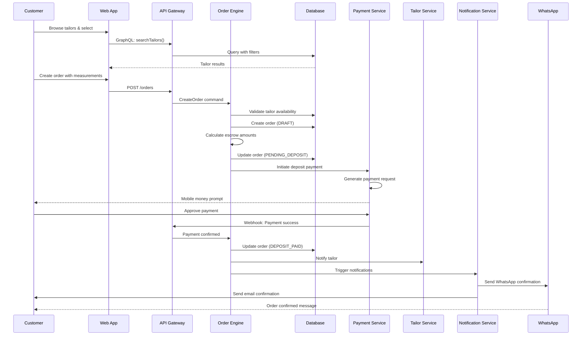
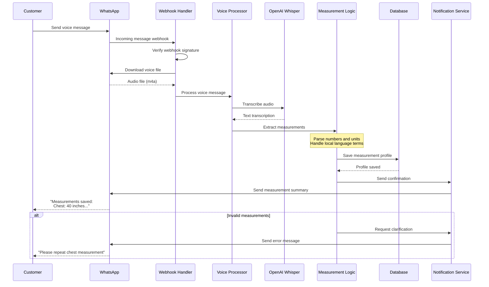
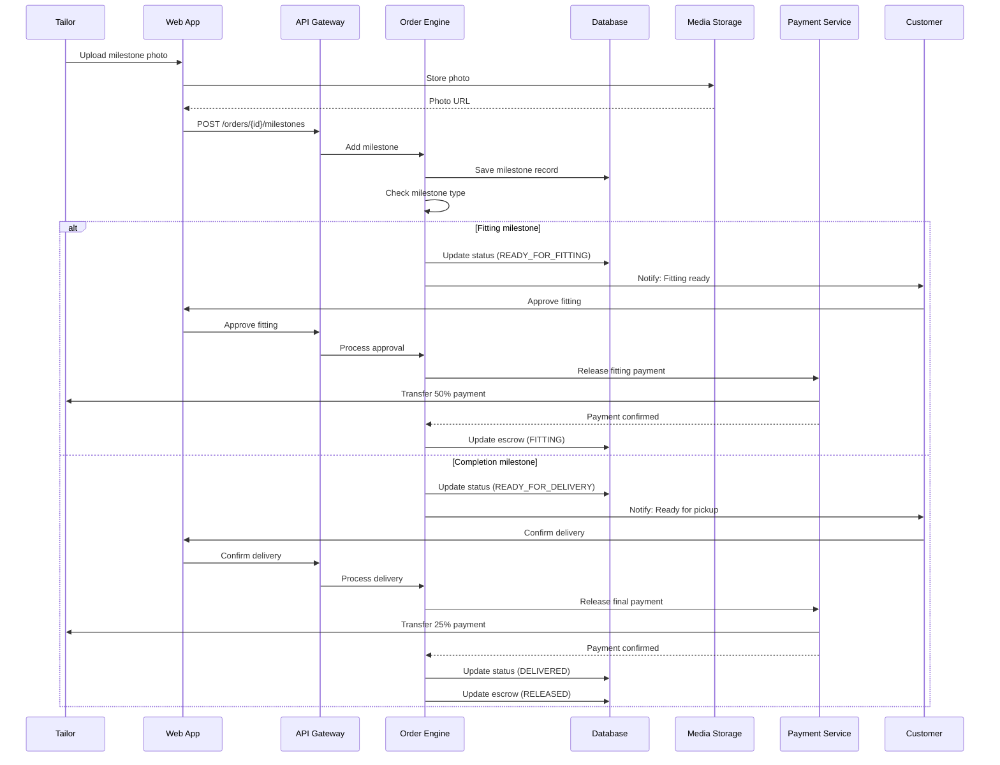
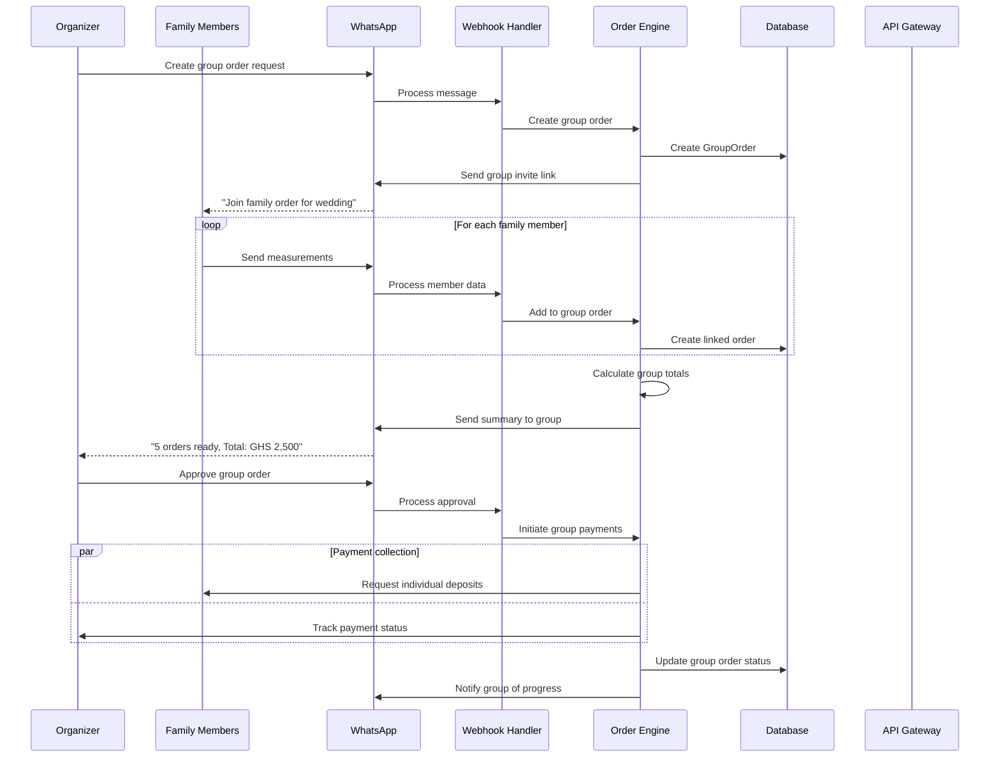
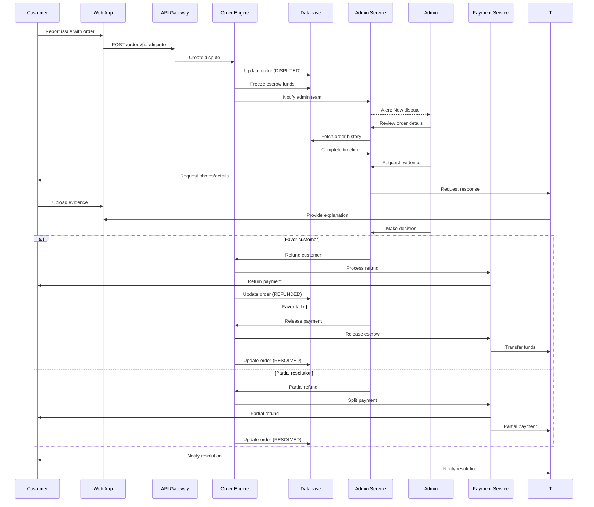

# Core Workflows

## Customer Order Creation Workflow

## WhatsApp Voice Measurement Collection

## Order Milestone & Escrow Progression

## Family Group Order Coordination

## Dispute Resolution Workflow

