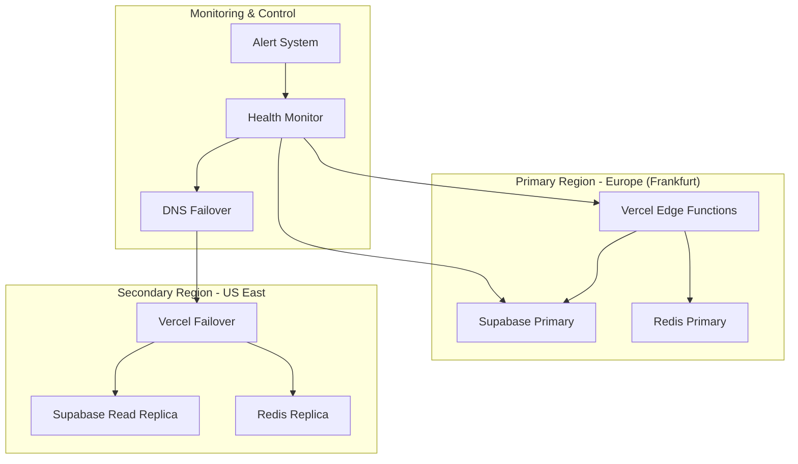

# Disaster Recovery & Business Continuity

## High Availability Architecture

**Multi-Region Failover Strategy:**


## Service-Level Recovery Plans

**Supabase Database Outage:**
```typescript
// Database failover implementation
export class DatabaseFailoverService {
  private primaryClient: SupabaseClient;
  private readReplicaClient: SupabaseClient;
  private isUsingPrimary = true;
  
  async executeQuery<T>(operation: (client: SupabaseClient) => Promise<T>): Promise<T> {
    try {
      if (this.isUsingPrimary) {
        return await operation(this.primaryClient);
      }
    } catch (error) {
      logger.warn('Primary database unavailable, switching to read replica');
      this.isUsingPrimary = false;
      
      // For read operations, use replica
      if (this.isReadOperation(operation)) {
        return await operation(this.readReplicaClient);
      }
      
      // For write operations, implement offline queue
      await this.queueWriteOperation(operation);
      throw new ServiceUnavailableError('Write operations temporarily queued');
    }
  }
  
  async healthCheck(): Promise<boolean> {
    try {
      await this.primaryClient.from('health_check').select('*').limit(1);
      this.isUsingPrimary = true;
      return true;
    } catch {
      return false;
    }
  }
}
```

**WhatsApp API Outage:**
```typescript
// WhatsApp failover to SMS
export class CommunicationFailoverService {
  private whatsappHealthy = true;
  
  async sendMessage(recipient: string, message: string): Promise<void> {
    if (this.whatsappHealthy) {
      try {
        await this.whatsappService.send(recipient, message);
        return;
      } catch (error) {
        logger.error('WhatsApp API failed, switching to SMS', { error });
        this.whatsappHealthy = false;
      }
    }
    
    // Fallback to SMS
    await this.smsService.send(recipient, message);
    
    // Add to retry queue for WhatsApp when healthy
    await this.queueForRetry(recipient, message);
  }
  
  async checkWhatsAppHealth(): Promise<void> {
    try {
      await this.whatsappService.healthCheck();
      this.whatsappHealthy = true;
      await this.processRetryQueue();
    } catch {
      this.whatsappHealthy = false;
    }
  }
}
```

**Mobile Money Provider Outage:**
```typescript
// Payment provider failover
export class PaymentProviderFailover {
  private providerHealth = new Map<PaymentProvider, boolean>();
  
  async processPayment(
    amount: number, 
    phone: string, 
    preferredProvider?: PaymentProvider
  ): Promise<PaymentResult> {
    const providers = this.getHealthyProviders();
    
    if (providers.length === 0) {
      // No providers available - store for later processing
      await this.queuePayment({ amount, phone, preferredProvider });
      return { status: 'QUEUED', message: 'Payment queued for processing' };
    }
    
    // Try preferred provider first if healthy
    if (preferredProvider && providers.includes(preferredProvider)) {
      try {
        return await this.executePayment(preferredProvider, amount, phone);
      } catch (error) {
        this.markProviderUnhealthy(preferredProvider);
      }
    }
    
    // Try other healthy providers
    for (const provider of providers) {
      try {
        return await this.executePayment(provider, amount, phone);
      } catch (error) {
        this.markProviderUnhealthy(provider);
      }
    }
    
    throw new Error('All payment providers unavailable');
  }
}
```

## Data Backup & Recovery

**Automated Backup Strategy:**
```bash
#!/bin/bash