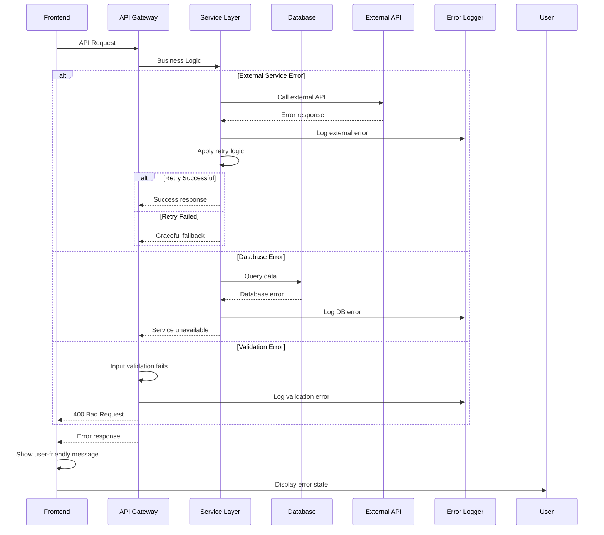

# Error Handling Strategy

## Error Flow



## Error Response Format

```typescript
interface ApiError {
  error: {
    code: string;
    message: string;
    details?: Record<string, any>;
    timestamp: string;
    requestId: string;
  };
}

// Standard error codes
export const ERROR_CODES = {
  // Authentication errors
  AUTH_TOKEN_EXPIRED: 'AUTH_TOKEN_EXPIRED',
  AUTH_INVALID_CREDENTIALS: 'AUTH_INVALID_CREDENTIALS',
  AUTH_INSUFFICIENT_PERMISSIONS: 'AUTH_INSUFFICIENT_PERMISSIONS',
  
  // Validation errors
  VALIDATION_FAILED: 'VALIDATION_FAILED',
  VALIDATION_PHONE_INVALID: 'VALIDATION_PHONE_INVALID',
  VALIDATION_AMOUNT_INVALID: 'VALIDATION_AMOUNT_INVALID',
  
  // Business logic errors
  ORDER_NOT_FOUND: 'ORDER_NOT_FOUND',
  TAILOR_NOT_AVAILABLE: 'TAILOR_NOT_AVAILABLE',
  PAYMENT_ALREADY_PROCESSED: 'PAYMENT_ALREADY_PROCESSED',
  ESCROW_STAGE_INVALID: 'ESCROW_STAGE_INVALID',
  
  // External service errors
  WHATSAPP_SERVICE_UNAVAILABLE: 'WHATSAPP_SERVICE_UNAVAILABLE',
  PAYMENT_PROVIDER_ERROR: 'PAYMENT_PROVIDER_ERROR',
  VOICE_TRANSCRIPTION_FAILED: 'VOICE_TRANSCRIPTION_FAILED',
  
  // Infrastructure errors
  DATABASE_CONNECTION_ERROR: 'DATABASE_CONNECTION_ERROR',
  RATE_LIMIT_EXCEEDED: 'RATE_LIMIT_EXCEEDED',
  SERVICE_UNAVAILABLE: 'SERVICE_UNAVAILABLE',
} as const;
```
