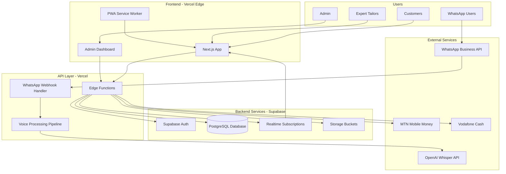

# High Level Architecture

**Technical Summary:**
Sew4Mi will be built as a modern JAMstack application with Next.js frontend and serverless backend, optimized for Ghana's mobile-first market. The architecture leverages Vercel for edge deployment with Supabase providing real-time database, authentication, and storage services. WhatsApp Business API integration enables conversational commerce through natural language processing and voice measurement extraction. The progressive web app will ensure offline functionality while the serverless architecture provides cost-effective scaling during peak seasons, achieving the PRD goals of 2,000 orders in Year 1 with 80% on-time delivery.

**Platform and Infrastructure Choice:**

**Selected Platform:** Vercel + Supabase
**Key Services:** Vercel Edge Functions, Supabase Database, Supabase Auth, Supabase Storage, Vercel KV (Redis) for caching
**Deployment Host and Regions:** Vercel Global Edge Network with primary region in Europe (closest to Ghana)

**Repository Structure:**
**Structure:** Monorepo
**Monorepo Tool:** Turborepo (optimized for Vercel deployment)
**Package Organization:** Apps (web, admin), Packages (shared types, UI components, API clients)

**High Level Architecture Diagram:**

**Architectural Patterns:**
- **JAMstack Architecture:** Static site generation with serverless APIs - _Rationale:_ Optimal performance on 3G networks with edge caching
- **Component-Based UI:** Reusable React components with TypeScript - _Rationale:_ Maintainability and type safety for AI-driven development
- **Repository Pattern:** Abstract data access through Supabase client - _Rationale:_ Clean separation of concerns and testability
- **Event-Driven Updates:** Real-time subscriptions for order status - _Rationale:_ Instant updates improve trust and user experience
- **Progressive Web App:** Offline-first with service workers - _Rationale:_ Critical for intermittent connectivity in Ghana
- **Webhook Pattern:** WhatsApp integration via webhooks - _Rationale:_ Reliable message delivery and processing
- **Escrow State Machine:** State-based payment progression - _Rationale:_ Clear business logic for complex payment flows
- **Circuit Breaker Pattern:** Prevent cascading failures from external services - _Rationale:_ Essential for mobile money and WhatsApp API stability
- **Saga Pattern:** Manage complex distributed transactions - _Rationale:_ Ensure order consistency across payment and fulfillment
- **Event Sourcing:** Immutable audit trail for payments and disputes - _Rationale:_ Required for regulatory compliance and dispute resolution
