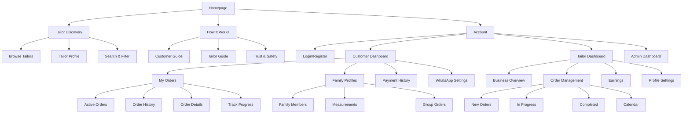
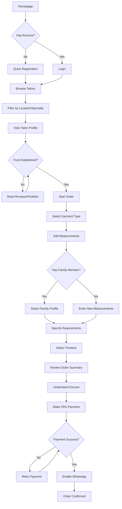
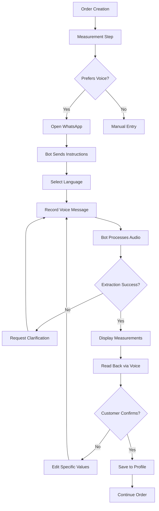
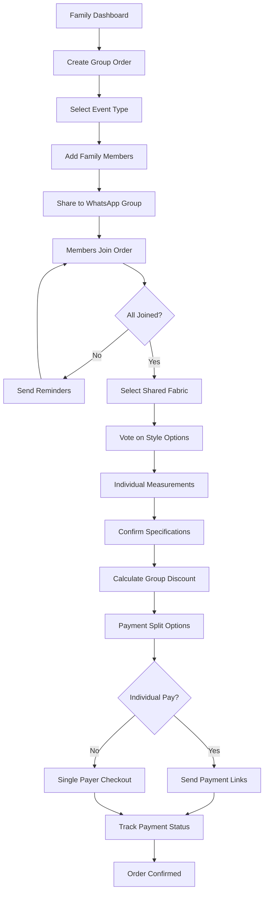
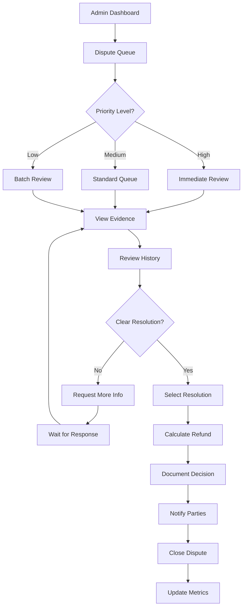
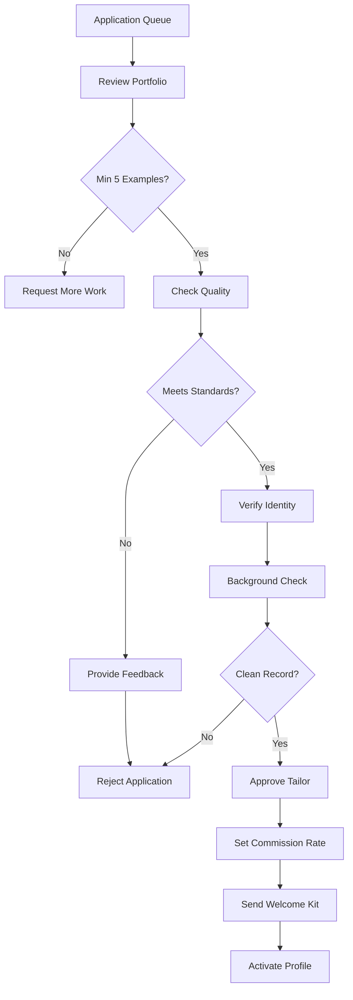

# Sew4Mi UI/UX Specification

## Introduction

This document defines the user experience goals, information architecture, user flows, and visual design specifications for Sew4Mi's user interface. It serves as the foundation for visual design and frontend development, ensuring a cohesive and user-centered experience.

Sew4Mi is a trust-first custom clothing marketplace that transforms Ghana's ₵500M tailoring industry from unreliable transactions into a dependable service. The platform connects emerging professionals and event-goers with verified expert tailors through a progressive escrow payment system, real-time order tracking, and comprehensive WhatsApp integration. By preserving the personal relationships and cultural expertise of traditional tailoring while adding payment protection and delivery reliability, Sew4Mi serves Ghana's 400,000+ professionals who need quality custom clothing for career advancement and cultural events.

## Overall UX Goals & Principles

Based on the PRD and Ghana's cultural context, here are the foundational UX elements for Sew4Mi:

### Target User Personas

**Primary Users:**
- **Emerging Professional:** Recent graduates and young professionals (ages 25-35) building career wardrobes who need reliable custom clothing for workplace and networking events
- **Event Coordinator:** Family members (often women) who organize custom clothing for weddings, funerals, church events, and graduations, managing multiple orders with coordination needs  
- **Expert Tailor:** Skilled craftspeople seeking business growth through verified marketplace participation, needing tools to manage orders, payments, and customer relationships
- **Family Organizer:** Customers who regularly order for multiple family members, requiring efficient measurement management and group coordination features

### Usability Goals

- **Trust Building:** New users feel confident in the escrow system within first visit, understanding payment protection clearly
- **Quick Discovery:** Users can find and evaluate expert tailors within 3 taps, with portfolio reviews and ratings prominently displayed
- **Mobile Efficiency:** Core tasks (order creation, progress tracking, payments) work seamlessly on mobile with Ghana's 3G network speeds  
- **WhatsApp Integration:** 70% of users adopt WhatsApp features for notifications, measurements, and family coordination within 6 months

### Design Principles

1. **Trust Through Transparency** - Every interaction reinforces security, progress visibility, and payment protection to overcome industry trust issues
2. **Cultural Authenticity** - Celebrate Ghanaian craftsmanship and family-centered decision making while maintaining modern usability
3. **Mobile-First Resilience** - Design for intermittent 3G connectivity with offline capabilities and progressive loading  
4. **Progressive Disclosure** - Start with core trust-building features, gradually reveal advanced tools as user confidence grows
5. **WhatsApp-Native Flow** - Leverage Ghana's most familiar communication platform for seamless order management and family coordination

### Change Log
| Date | Version | Description | Author |
|------|---------|-------------|---------|
| 2025-08-07 | 1.0 | Initial UI/UX Specification creation based on PRD | Sally (UX Expert) |

## Information Architecture (IA)

### Site Map / Screen Inventory

### Navigation Structure

**Primary Navigation:** 
- **Homepage** - Trust-building hero with quick tailor search
- **Find Tailors** - Discovery with filters and map view
- **How It Works** - Escrow explanation and process overview
- **Dashboard** - Role-based access (Customer/Tailor/Admin)
- **WhatsApp** - Quick access to bot conversation

**Secondary Navigation:**
- Account settings and profile management
- Help center and FAQs
- Language selector (English/Twi/Ga)
- Contact support via WhatsApp

**Breadcrumb Strategy:** 
- Show on all pages except homepage
- Format: Home > Category > Current Page
- Mobile: Compressed to show only parent page
- Include order number in order-specific pages

## User Flows

### Flow 1: First-Time Customer Order Creation

**User Goal:** Place my first custom clothing order with confidence in the payment protection system

**Entry Points:** Homepage hero CTA, Google search, WhatsApp shared link, Facebook ad

**Success Criteria:** Order placed with 25% initial payment completed and WhatsApp notifications enabled

#### Flow Diagram

#### Edge Cases & Error Handling:
- Payment failure: Offer alternative payment methods (different mobile money provider)
- Tailor unavailable: Suggest similar tailors with availability
- Network timeout: Save order draft for completion later
- Measurement confusion: Provide video guide or WhatsApp voice assistance

**Notes:** First-time users need extra trust-building through escrow explanation and verified tailor badges

### Flow 2: WhatsApp Voice Measurement Collection

**User Goal:** Provide accurate measurements using voice messages in my preferred language

**Entry Points:** Order creation flow, WhatsApp bot conversation, measurement update reminder

**Success Criteria:** Measurements captured accurately and confirmed by customer

#### Flow Diagram

#### Edge Cases & Error Handling:
- Background noise: Request re-recording in quieter environment
- Mixed languages: Process common code-switching patterns
- Unusual measurements: Flag and request verification
- Network issues: Queue messages for processing when connected

**Notes:** Support for English, Twi, and Ga with automatic language detection

### Flow 3: Family Group Order Coordination

**User Goal:** Coordinate matching outfits for family wedding with individual measurements and shared fabric

**Entry Points:** Family dashboard, WhatsApp group chat, event planning prompt

**Success Criteria:** Multiple coordinated orders placed with individual payments tracked

#### Flow Diagram

#### Edge Cases & Error Handling:
- Member doesn't respond: Allow order to proceed without them
- Payment mismatch: Clear breakdown of who owes what
- Size unavailable: Suggest alternative fabric with similar appearance
- Delivery timing: Option for staggered delivery if needed

**Notes:** Leverage WhatsApp groups for family decision-making while maintaining individual privacy for measurements

## Wireframes & Mockups

**Primary Design Files:** [Figma/Sketch designs to be created based on this specification]

### Key Screen Layouts

#### Homepage
**Purpose:** Build immediate trust and guide users to browse tailors or understand the escrow system

**Key Elements:**
- Hero section with trust messaging: "Your Payment Protected Until Delivery"
- Escrow process visualization (3 steps with icons)
- Featured verified tailors carousel
- Quick search by location/garment type
- Success metrics banner (2,000+ orders, 80% on-time)
- WhatsApp CTA floating button

**Interaction Notes:** Progressive disclosure of escrow details on hover/tap. Auto-rotate featured tailors every 5 seconds.

**Design File Reference:** Homepage_Mobile_Desktop.fig

#### Tailor Profile Page
**Purpose:** Establish trust and showcase expertise to convert browsers into customers

**Key Elements:**
- Verification badge and business details
- Portfolio gallery (minimum 5 examples)
- Ratings breakdown and reviews
- Specialization tags
- Availability calendar
- "Start Order" and "WhatsApp Chat" CTAs
- Pricing guide for common garments

**Interaction Notes:** Lazy load portfolio images. Quick view for portfolio items without leaving page.

**Design File Reference:** TailorProfile_Responsive.fig

#### Order Creation Wizard
**Purpose:** Guide customers through order specification with confidence at each step

**Key Elements:**
- Progress indicator (5 steps)
- Visual garment type selector
- Measurement interface with voice option
- Family member selector
- Timeline picker with pricing impact
- Escrow payment breakdown
- WhatsApp opt-in with benefits

**Interaction Notes:** Save progress automatically. Allow back navigation without data loss.

**Design File Reference:** OrderWizard_Flow.fig

#### Order Tracking Dashboard
**Purpose:** Provide transparency and build excitement as order progresses

**Key Elements:**
- Visual timeline with current status
- Milestone photos in expandable cards
- Payment status for each milestone
- Estimated delivery countdown
- Quick message to tailor
- Dispute/help button

**Interaction Notes:** Push notifications for status changes. Photo zoom on tap.

**Design File Reference:** OrderTracking_Mobile.fig

## Component Library / Design System

**Design System Approach:** Build custom component library with Ghanaian cultural elements while maintaining modern usability standards. Components should work across mobile, tablet, and desktop with consistent behavior.

### Core Components

#### Trust Badge
**Purpose:** Reinforce payment protection and platform verification throughout the experience

**Variants:** 
- Escrow protected badge
- Verified tailor badge
- On-time delivery badge
- Platform guarantee badge

**States:** Default, hover (with tooltip), disabled

**Usage Guidelines:** Display on all transaction pages, tailor profiles, and order confirmations

#### Payment Milestone Card
**Purpose:** Clearly communicate payment stages and protection at each milestone

**Variants:**
- 25% initial (pending/paid)
- 50% fitting (locked/released/paid)
- 25% delivery (locked/released/paid)

**States:** Locked, available, processing, completed, disputed

**Usage Guidelines:** Use consistent colors (grey=locked, yellow=available, green=completed, red=disputed)

#### Family Member Selector
**Purpose:** Quick selection of family profiles during order creation

**Variants:**
- Grid view (mobile)
- List view (desktop)
- Add new member card

**States:** Default, selected, hover, disabled

**Usage Guidelines:** Show avatar/photo, nickname, and last measurement date. Maximum 8 members visible before scroll.

#### WhatsApp Integration Button
**Purpose:** Seamless connection to WhatsApp for various actions

**Variants:**
- Chat with tailor
- Voice measurement
- Share with family
- Get support

**States:** Default, hover, active, loading

**Usage Guidelines:** Use official WhatsApp green (#25D366) for brand recognition. Include icon and clear action text.

## Branding & Style Guide

### Visual Identity
**Brand Guidelines:** Modern African aesthetic celebrating Ghana's tailoring heritage while building trust through contemporary design

### Color Palette
| Color Type | Hex Code | Usage |
|------------|----------|--------|
| Primary | #1B4F72 | Headers, CTAs, trust elements |
| Secondary | #D4AC0D | Accent, highlights, success states |
| Accent | #C0392B | Traditional elements, celebration |
| Success | #27AE60 | Confirmations, completed milestones |
| Warning | #F39C12 | Cautions, pending actions |
| Error | #E74C3C | Errors, disputes, failed payments |
| Neutral | #2C3E50, #95A5A6, #ECF0F1 | Text, borders, backgrounds |

### Typography

#### Font Families
- **Primary:** Inter (clean, readable on all devices)
- **Secondary:** Playfair Display (elegant headers)
- **Monospace:** JetBrains Mono (order numbers, codes)

#### Type Scale
| Element | Size | Weight | Line Height |
|---------|------|--------|-------------|
| H1 | 32px/2rem | 700 | 1.2 |
| H2 | 24px/1.5rem | 600 | 1.3 |
| H3 | 20px/1.25rem | 600 | 1.4 |
| Body | 16px/1rem | 400 | 1.6 |
| Small | 14px/0.875rem | 400 | 1.5 |

### Iconography
**Icon Library:** Phosphor Icons (comprehensive, culturally neutral)

**Usage Guidelines:** 
- Use filled icons for primary actions
- Use outlined icons for secondary actions
- Maintain 24px base size, scale proportionally
- Include text labels for clarity on mobile

### Spacing & Layout
**Grid System:** 12-column grid with 16px gutters

**Spacing Scale:** 
- 4px (xs)
- 8px (sm)
- 16px (md)
- 24px (lg)
- 32px (xl)
- 48px (xxl)

## Accessibility Requirements

### Compliance Target
**Standard:** WCAG 2.1 Level AA compliance with considerations for Ghana's diverse user base

### Key Requirements

**Visual:**
- Color contrast ratios: Minimum 4.5:1 for normal text, 3:1 for large text
- Focus indicators: 2px solid outline with 2px offset, color: #1B4F72
- Text sizing: Base 16px, user scalable up to 200% without horizontal scroll

**Interaction:**
- Keyboard navigation: All interactive elements accessible via Tab key
- Screen reader support: ARIA labels for all icons, images, and complex components
- Touch targets: Minimum 44x44px with 8px spacing between targets

**Content:**
- Alternative text: Descriptive alt text for all portfolio images and instructional graphics
- Heading structure: Logical H1-H6 hierarchy, one H1 per page
- Form labels: Clear, persistent labels (not placeholder-only)

### Testing Strategy
- Automated testing with axe-core
- Manual testing with NVDA/JAWS screen readers
- Color blind simulation testing
- Keyboard-only navigation testing
- Testing on low-end Android devices common in Ghana

## Responsiveness Strategy

### Breakpoints
| Breakpoint | Min Width | Max Width | Target Devices |
|------------|-----------|-----------|----------------|
| Mobile | 320px | 767px | Smartphones (majority of users) |
| Tablet | 768px | 1023px | Tablets, large phones |
| Desktop | 1024px | 1439px | Laptops, desktops |
| Wide | 1440px | - | Large monitors |

### Adaptation Patterns

**Layout Changes:** 
- Mobile: Single column, stacked components
- Tablet: Two column where beneficial, side navigation
- Desktop: Multi-column, persistent sidebars

**Navigation Changes:**
- Mobile: Hamburger menu with full-screen overlay
- Tablet: Condensed top bar with dropdowns
- Desktop: Full horizontal navigation with mega-menus

**Content Priority:**
- Mobile: Critical actions above fold, progressive disclosure
- Tablet: Balanced information density
- Desktop: Full information display with filtering

**Interaction Changes:**
- Mobile: Touch-optimized with swipe gestures
- Tablet: Hybrid touch/hover states
- Desktop: Hover states, keyboard shortcuts

## Animation & Micro-interactions

### Motion Principles
- **Performance First:** Animations under 300ms for perceived speed
- **Cultural Sensitivity:** Subtle, professional movements (not playful)
- **Accessibility:** Respect prefers-reduced-motion settings
- **Purpose-Driven:** Every animation should guide or inform

### Key Animations
- **Page Transitions:** Slide left/right (200ms, ease-in-out)
- **Milestone Progress:** Step completion celebration (300ms, ease-out)
- **Payment Processing:** Pulsing loader with progress (Duration: continuous, Easing: linear)
- **WhatsApp Message Received:** Subtle slide-up with sound (150ms, ease-out)
- **Trust Badge Hover:** Scale and tooltip reveal (200ms, ease-in-out)
- **Error Shake:** Horizontal shake for validation errors (300ms, ease-in-out)

## Performance Considerations

### Performance Goals
- **Page Load:** < 3 seconds on 3G networks
- **Interaction Response:** < 100ms for user input feedback
- **Animation FPS:** Consistent 60fps for all animations

### Design Strategies
- Progressive image loading with blur-up technique
- Skeleton screens while content loads
- Inline critical CSS, defer non-critical
- Lazy load below-fold content
- WebP images with JPEG fallback
- Icon fonts for UI elements
- Service Worker for offline functionality
- CDN delivery for all static assets

## Admin Portal Specifications

### Admin Dashboard Overview

**Purpose:** Provide platform administrators with real-time monitoring, quality control, and operational management tools to maintain service excellence at scale

**Key Principles:**
- **Information Density:** Admins need comprehensive data at a glance
- **Quick Actions:** Common interventions should be one-click accessible
- **Real-time Updates:** Critical metrics refresh automatically
- **Multi-Admin Support:** Role-based permissions and activity logging

### Admin User Flows

#### Flow 4: Dispute Resolution Management

**User Goal:** Efficiently resolve customer-tailor disputes within 48-hour SLA

**Entry Points:** Admin dashboard alerts, email notifications, WhatsApp admin alerts

**Success Criteria:** Dispute resolved with documented decision and both parties notified

#### Flow 5: Tailor Verification Process

**User Goal:** Verify new expert tailors meet quality standards before marketplace access

**Entry Points:** New application notification, verification queue

**Success Criteria:** Tailor approved/rejected with clear feedback provided

### Admin Screen Layouts

#### Operations Dashboard
**Purpose:** Real-time platform health monitoring and intervention capabilities

**Key Elements:**
- **Metrics Grid (Top):**
  - Active orders count with status breakdown
  - Payment processing (success/failure rates)
  - User activity (customers online, tailors active)
  - System health indicators
  
- **Alert Panel (Left):**
  - Overdue disputes with countdown timers
  - Failed payments requiring investigation
  - Quality issues flagged by customers
  - System errors and warnings
  
- **Quick Actions (Right):**
  - Broadcast announcement
  - Pause tailor account
  - Process manual refund
  - Contact support team
  
- **Activity Feed (Bottom):**
  - Recent admin actions log
  - Major transaction history
  - User registrations/verifications

**Interaction Notes:** Auto-refresh every 30 seconds. Click metrics for detailed drilldown. Drag-and-drop alert prioritization.

#### Dispute Resolution Center
**Purpose:** Comprehensive dispute management with evidence review and resolution tools

**Key Elements:**
- **Queue Table:**
  - Dispute ID, parties involved, amount, age, priority
  - Color coding: red (>24hrs), yellow (12-24hrs), green (<12hrs)
  - Bulk action checkboxes
  
- **Detail View (Modal):**
  - Full conversation thread
  - Uploaded evidence gallery
  - Order history and timeline
  - Previous dispute history for both parties
  
- **Resolution Panel:**
  - Template responses dropdown
  - Refund calculator with split options
  - Resolution type selector
  - Documentation text area
  
- **Metrics Sidebar:**
  - Average resolution time
  - Dispute trends graph
  - Common dispute categories
  - Admin performance stats

#### Quality Control Dashboard
**Purpose:** Monitor and maintain marketplace quality standards

**Key Elements:**
- **Tailor Performance Matrix:**
  - Sortable table with ratings, completion rate, dispute rate
  - Visual indicators for below-threshold performance
  - One-click coaching recommendation
  
- **Application Review Queue:**
  - Pending applications with days waiting
  - Portfolio preview thumbnails
  - Quick approve/reject buttons
  - Bulk actions for similar applications
  
- **Quality Metrics:**
  - Platform-wide satisfaction score
  - Category performance breakdown
  - Geographic quality heatmap
  - Trending issues identification

#### Financial Management
**Purpose:** Track revenue, process payments, and manage platform finances

**Key Elements:**
- **Revenue Dashboard:**
  - Daily/weekly/monthly revenue charts
  - Commission breakdown by tailor
  - Payment method distribution
  - Refund and dispute costs
  
- **Payout Management:**
  - Pending tailor payouts table
  - Batch processing capabilities
  - Payment failure handling
  - Commission adjustment tools
  
- **Reconciliation Tools:**
  - Hubtel transaction matching
  - Escrow balance tracking
  - Missing payment investigation
  - Export for accounting

### Admin-Specific Components

#### Priority Alert Card
**Purpose:** Surface critical issues requiring immediate attention

**Variants:**
- Overdue dispute (red)
- System error (orange)
- Verification pending (yellow)
- Milestone payment stuck (purple)

**States:** Active, acknowledged, resolved, escalated

#### Metrics Widget
**Purpose:** Display key performance indicators with trend visualization

**Variants:**
- Single metric with sparkline
- Comparison metric (vs. last period)
- Goal progress bar
- Real-time counter

**States:** Loading, normal, warning, critical

#### Admin Action Button
**Purpose:** Provide quick access to common administrative actions

**Variants:**
- Approve (green)
- Reject (red)
- Investigate (blue)
- Escalate (orange)

**States:** Default, loading, success, error

### Admin Performance Considerations

**Dashboard Optimization:**
- WebSocket connections for real-time updates
- Pagination for large data sets
- Virtual scrolling for long lists
- Batch operations to reduce API calls
- Caching strategy for historical data

**Security Requirements:**
- Two-factor authentication mandatory
- IP whitelist for admin access
- Session timeout after 30 minutes idle
- Audit log for all admin actions
- Role-based access control (super admin, support, finance)

## Next Steps

### Immediate Actions
1. Review specification with stakeholders for alignment
2. Create high-fidelity mockups in Figma based on wireframe descriptions
3. Prototype key interactions (escrow explanation, order flow)
4. Validate with user testing in Ghana market
5. Prepare design handoff documentation for development team

### Design Handoff Checklist
- [x] All user flows documented
- [x] Component inventory complete
- [x] Accessibility requirements defined
- [x] Responsive strategy clear
- [x] Brand guidelines incorporated
- [x] Performance goals established

## Checklist Results

All UI/UX specification sections have been completed with comprehensive detail aligned to the PRD requirements. The specification is ready for design implementation and architectural planning.

